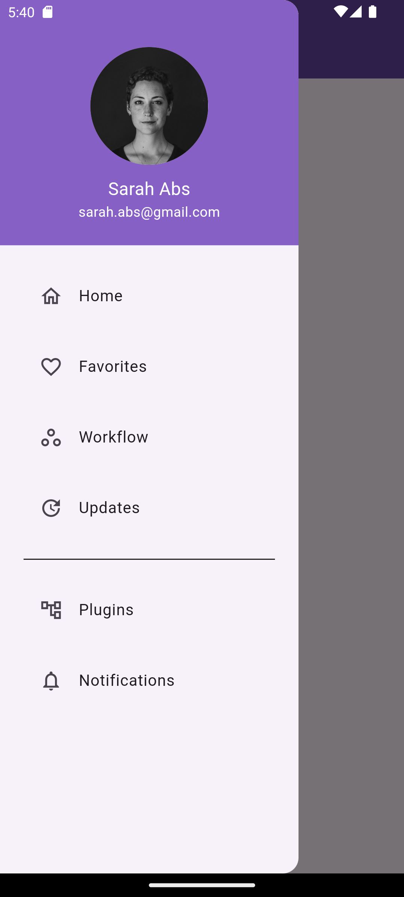

# 🎯 Navigation Drawer

O Drawer é um widget do Flutter que funciona como um painel deslizante que aparece na lateral da tela quando o usuário clica em um ícone de menu personalizado. Ele permite que os usuários naveguem entre diferentes telas do aplicativo.

 

| HomePage | UserPage |
|-----------|----------|
|  |  |

## 📝 Descrição

Nesse projeto, o Drawer foi utilizado para organizar um menu de navegação com acesso as telas às seguintes telas:

- *Home*
- *Favorites*
- *Workflow* 
- *Updates*
- *Plugins*
- *Notifications*

Além do *Perfil do Usuário* que a navegação é feita com o widget InkWell que captura o toque do usuário através da interação no cabeçalho (container), os outros itens do menu apenas utilizam o widget ListTile para que o item do menu seja clicável. 

Para melhorar a modularidade e flexibilidade do código, os widgets do perfil do usuário foram organizados em arquivos separados:

- *ButtonWidget* – Botão personalizado para reutilização em todo o projeto se necessário.
- *NumbersWidget* – Exibição dos números Ranking, Following e Followers.
- *ProfileWidget* – Foto de perfil e informações do usuário.

## ☕ Dados do Usuário

No projeto, foi criado um modelo de dados para representar um usuário do aplicativo. Uma única instância foi armazenada na classe UserPreferences, contendo as informações do usuário padrão.

Essa abordagem facilita a manutenção do código, evita a duplicação de informações e melhora a modularidade do projeto.

## 🔧 Tecnologias

- 🚀 Flutter – Framework para desenvolvimento de aplicativos multiplataforma.
- 💻 Dart – Linguagem de programação utilizada no Flutter.

## 📚 Recursos e Tutoriais

- [Navigation Drawer](https://www.youtube.com/watch?v=17FLO6uHhHU)
- [User Profile Page UI](https://www.youtube.com/watch?v=gSl-MoykYYk&t=855s)
